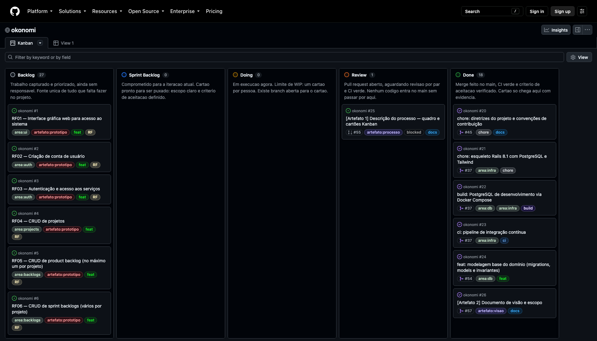
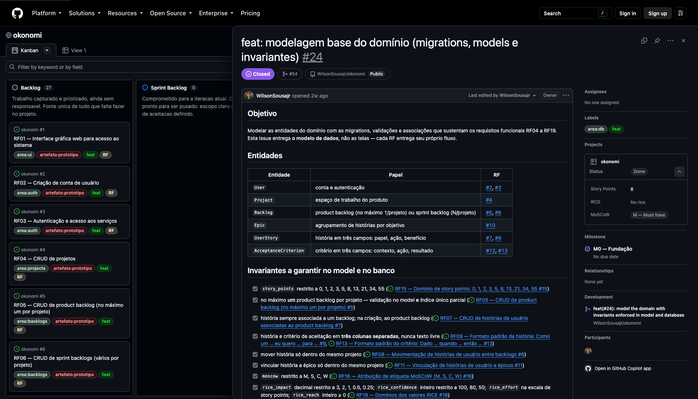

# Descrição do processo de gerenciamento

**Artefato 1** do Trabalho Prático de Engenharia de Software (2026.2) — okonomi.
Rastreado pela issue [#25](https://github.com/WilsonSousajr/okonomi/issues/25).
Atende às instruções 8 a 12 da seção 4 e ao Critério de Avaliação 01 do enunciado.

## 1. Método adotado: Kanban

O projeto é gerenciado pelo método **Kanban**. O trabalho é representado por
cartões em um quadro visível a todos; cada cartão atravessa colunas que
representam os estados do trabalho, da captura à entrega. O fluxo é **puxado**:
ninguém recebe trabalho empurrado; quem está livre puxa o próximo cartão mais
prioritário do Sprint Backlog.

Escolhemos Kanban por três motivos:

- **O trabalho é heterogêneo.** Documentos (artefatos 1 a 7 e 9), código
  (protótipo, artefato 8) e infraestrutura convivem no mesmo projeto. Kanban não
  exige que tudo caiba numa mesma cadência de sprint.
- **O gargalo fica visível.** Com poucos cartões em execução, uma coluna que
  acumula cartões aponta onde o fluxo travou.
- **O quadro é um registro auditável.** Como cada cartão é uma issue do GitHub, o
  histórico de cada mudança de coluna, comentário e PR fica guardado.

Regras do fluxo:

| Regra | Como é aplicada |
|---|---|
| **Limite de WIP** | No máximo **1 cartão por pessoa** na coluna Doing. Antes de puxar outro, o atual vai para Review. |
| **Tudo nasce de uma issue** | Nenhum commit, branch ou PR existe sem uma issue que lhe dê contexto. Trabalho descoberto no meio do caminho (por exemplo, um defeito) vira uma issue nova antes de ser feito. |
| **Mover na hora** | O cartão muda de coluna quando o estado muda, nunca em lote no fim. |
| **Política explícita de saída** | Cada coluna tem um critério de saída (seção 2). Um cartão só avança quando o cumpre. |
| **Iterações por marco** | O trabalho é agrupado em seis marcos (*milestones*), M0 a M5, que funcionam como iterações do processo iterativo e incremental pedido na introdução do enunciado. |

## 2. O quadro

Quadro: **[okonomi — GitHub Projects](https://github.com/users/WilsonSousajr/projects/14)**,
na visão *Board*, agrupado pelo campo **Status**.

| Coluna | Propósito | Critério de saída |
|---|---|---|
| **Backlog** | Trabalho capturado e priorizado, ainda sem responsável. É a fonte única de tudo que falta fazer. | Escopo entendido; MoSCoW e story points definidos. |
| **Sprint Backlog** | Trabalho comprometido para a iteração (marco) atual e pronto para ser puxado. | Critérios de aceitação escritos e story points estimados. |
| **Doing** | Em execução agora. Limite de WIP: 1 cartão por pessoa. | Branch aberta e vinculada à issue. |
| **Review** | Pull request aberto, aguardando revisão e o check `ci` da integração contínua. | PR aprovado e `ci` verde. |
| **Done** | Merge feito no `main`, CI verde e critérios de aceitação verificados. | Evidência registrada na issue (saída de testes, link do PR). |

A descrição de cada coluna também está cadastrada no próprio quadro, como
descrição da opção do campo Status e no README do projeto no GitHub.

### Marcos (iterações)

| Marco | Conteúdo | Critério de Avaliação |
|---|---|---|
| **M0 — Fundação** | Repositório, quadro, esqueleto Rails 8 + PostgreSQL, CI e modelo de domínio. | — |
| **M1 — Gestão do Projeto** | Artefato 1, equipe e autoria. | 01 |
| **M2 — Requisitos** | Artefatos 2, 3 e 4. | 02, 03, 04 |
| **M3 — Projeto** | Artefatos 5, 6 e 7. | 05, 06, 07 |
| **M4 — Protótipo** | RF01 a RF19 e artefato 8 (protótipo e vídeo). | 08 |
| **M5 — Implantação e Entrega** | Artefato 9 e empacotamento da entrega. | 09 |

## 3. Os cartões

Cada cartão do quadro é uma **issue** do repositório
[WilsonSousajr/okonomi](https://github.com/WilsonSousajr/okonomi). Pull requests
também aparecem no quadro, ligados à issue que fecham.

### Informação presente em cada cartão

| Campo | Conteúdo | Exemplo |
|---|---|---|
| **Título** | Tipo e resumo; requisitos funcionais começam por `RFnn`, artefatos por `[Artefato n]`. | `RF15 — Domínio de story points: 0, 1, 2, 3, 5, 8, 13, 21, 34, 55` |
| **Descrição** | Objetivo, escopo e **critérios de aceitação** no formato *Dado … quando … então …*, como caixas de seleção. Issues de artefato trazem também as instruções da seção 4 e os itens do critério de avaliação que cobrem. | ver [#15](https://github.com/WilsonSousajr/okonomi/issues/15) |
| **Label de tipo** | `feat` `fix` `docs` `test` `refactor` `chore` `build` `ci` `perf` `style` — o mesmo conjunto dos tipos de commit. | `feat` |
| **Label de área** | Parte do sistema afetada: `area:auth`, `area:projects`, `area:backlogs`, `area:stories`, `area:epics`, `area:criteria`, `area:estimation`, `area:prioritization`, `area:ui`, `area:db`, `area:infra`. | `area:estimation` |
| **Label de artefato** | `artefato:processo`, `artefato:visao`, `artefato:rnf`, `artefato:historias`, `artefato:arquitetura`, `artefato:interface`, `artefato:bd`, `artefato:prototipo`, `artefato:infraestrutura`. Mapeia 1:1 com os critérios de avaliação. | `artefato:prototipo` |
| **Labels de sinalização** | `RF` (implementa um requisito numerado da seção 2), `regression` (defeito que exige teste de regressão), `blocked`, `entrega`. | `RF` |
| **Marco** | Iteração em que o cartão será entregue (M0–M5). | `M4 — Protótipo` |
| **Story Points** | Esforço relativo na escala 0, 1, 2, 3, 5, 8, 13, 21, 34, 55 — a mesma que o sistema impõe às histórias (RF15). | `1` |
| **MoSCoW** | Prioridade: **M** (*must*), **S** (*should*), **C** (*could*), **W** (*won't*). | `M — Must have` |
| **RICE** | Pontuação (R × I × C) / E, usada para desempatar cartões de mesma prioridade MoSCoW dentro de um marco. | preenchido ao ordenar o M4 |
| **Status** | Coluna atual do quadro. | `Backlog` |
| **PR vinculado** | Pull request que implementa o cartão (`Closes #N`). | [#54](https://github.com/WilsonSousajr/okonomi/pull/54) fecha #24 |

Três modelos de issue padronizam a criação dos cartões:
[`requisito-funcional.md`](../.github/ISSUE_TEMPLATE/requisito-funcional.md),
[`artefato.md`](../.github/ISSUE_TEMPLATE/artefato.md) e
[`defeito.md`](../.github/ISSUE_TEMPLATE/defeito.md).

### Tipos de cartão

| Tipo | Quantidade | Origem |
|---|---|---|
| Requisito funcional (`RF`) | 19 | Um por requisito da seção 2 do enunciado (#1–#19). |
| Artefato (`artefato:*`) | 9 | Um por artefato da seção 3 (#25–#33). |
| Gestão e entrega | 3 | Processo e equipe (#34), geração dos PDFs (#58) e entrega final (#35). |
| Fundação e infraestrutura | 5 | Convenções, esqueleto, banco, CI e modelo de domínio (#20–#24). |
| Defeito (`fix` + `regression`) | 3 | Encontrados durante o trabalho (#36, #40, #52). |
| Manutenção | 2 | Ajustes de documentação e dependências (#46, #48). |

## 4. Ciclo de vida de um cartão

```
 Backlog ──► Sprint Backlog ──► Doing ──────────► Review ──────────► Done
 issue       critérios e        branch            PR aberto          merge no main,
 criada      pontos definidos   tipo/issue-N-…    Closes #N          critérios marcados
                                commits           CI (check `ci`)    com evidência
                                tipo(#N): …
```

1. **Captura.** Uma issue é criada a partir de um modelo, recebe labels, marco,
   story points e MoSCoW, e entra em **Backlog**.
2. **Compromisso.** No início de um marco, os cartões dele com critérios de
   aceitação escritos passam para **Sprint Backlog**.
3. **Execução.** Quem puxa o cartão o move para **Doing** e abre a branch
   `tipo/issue-N-resumo`. Cada commit segue `tipo(#N): mensagem`, validado pelo
   hook `.githooks/commit-msg`. Código segue TDD: o teste que falha vem antes.
4. **Revisão.** O PR, com título no mesmo padrão e `Closes #N` no corpo, move o
   cartão para **Review**. A CI roda RuboCop, Brakeman, auditoria de
   dependências, testes de unidade e testes de sistema; o `main` é protegido e só
   aceita merge com o check `ci` verde.
5. **Conclusão.** Após o merge, a issue fecha, o cartão vai para **Done** e os
   critérios de aceitação são marcados com a evidência.

## 5. Atividades de gerenciamento realizadas

| Atividade | Evidência |
|---|---|
| Criação do repositório com controle de versões (instrução 2). | [WilsonSousajr/okonomi](https://github.com/WilsonSousajr/okonomi) |
| Criação do quadro Kanban com cinco colunas e descrição de cada uma (instruções 9 e 10). | [Projeto 14](https://github.com/users/WilsonSousajr/projects/14) |
| Criação dos campos de cartão Story Points, MoSCoW e RICE. | Campos do projeto |
| Decomposição do enunciado em cartões: 19 RF, 9 artefatos, gestão e entrega (instrução 11). | Issues #1–#35 |
| Rastreamento de cada instrução (seção 4) e de cada item de critério (seção 5) como caixa de seleção dentro de um cartão. | Issues de artefato, #34 e #35 |
| Criação de labels de tipo, área, artefato e sinalização, e dos marcos M0–M5. | [Labels](https://github.com/WilsonSousajr/okonomi/labels), [Marcos](https://github.com/WilsonSousajr/okonomi/milestones) |
| Estimativa (story points) e priorização (MoSCoW) de todos os cartões. | Campos no quadro |
| Definição do padrão de commit e de branch, com validação automática. | `.githooks/commit-msg`, `AGENTS.md` |
| Proteção do `main`: PR obrigatório, check `ci` obrigatório, sem *force-push*. | Regras da branch |
| Integração contínua com análise estática e testes. | [`.github/workflows/ci.yml`](../.github/workflows/ci.yml) |
| Registro de defeitos encontrados como cartões com teste de regressão. | #36, #40, #52 |
| Geração dos artefatos textuais em PDF a partir do Markdown (instrução 7). | `bin/docs-pdf`, [`docs/pdf/`](pdf/), #58 |

## 6. Inventário de cartões

Retrato do quadro em **29/09/2026**, gerado com
`gh project item-list 14 --owner WilsonSousajr --format json`. O estado atual
está sempre no [quadro](https://github.com/users/WilsonSousajr/projects/14).

| Cartão | Título | Labels | Marco | Pontos | MoSCoW | Coluna |
|---|---|---|---|---|---|---|
| [#1](https://github.com/WilsonSousajr/okonomi/issues/1) | RF01 — Interface gráfica web para acesso ao sistema | `feat` `area:ui` `RF` `artefato:prototipo` | M4 | 5 | M | Backlog |
| [#2](https://github.com/WilsonSousajr/okonomi/issues/2) | RF02 — Criação de conta de usuário | `feat` `area:auth` `RF` `artefato:prototipo` | M4 | 3 | M | Backlog |
| [#3](https://github.com/WilsonSousajr/okonomi/issues/3) | RF03 — Autenticação e acesso aos serviços | `feat` `area:auth` `RF` `artefato:prototipo` | M4 | 3 | M | Backlog |
| [#4](https://github.com/WilsonSousajr/okonomi/issues/4) | RF04 — CRUD de projetos | `feat` `area:projects` `RF` `artefato:prototipo` | M4 | 3 | M | Backlog |
| [#5](https://github.com/WilsonSousajr/okonomi/issues/5) | RF05 — CRUD de product backlog (no máximo um por projeto) | `feat` `area:backlogs` `RF` `artefato:prototipo` | M4 | 5 | M | Backlog |
| [#6](https://github.com/WilsonSousajr/okonomi/issues/6) | RF06 — CRUD de sprint backlogs (vários por projeto) | `feat` `area:backlogs` `RF` `artefato:prototipo` | M4 | 3 | M | Backlog |
| [#7](https://github.com/WilsonSousajr/okonomi/issues/7) | RF07 — CRUD de histórias de usuário associadas ao product backlog | `feat` `area:stories` `RF` `artefato:prototipo` | M4 | 5 | M | Backlog |
| [#8](https://github.com/WilsonSousajr/okonomi/issues/8) | RF08 — Movimentação de histórias de usuário entre backlogs | `feat` `area:stories` `RF` `artefato:prototipo` | M4 | 5 | M | Backlog |
| [#9](https://github.com/WilsonSousajr/okonomi/issues/9) | RF09 — Formato padrão da história: Como um … eu quero … para … | `feat` `area:stories` `RF` `artefato:historias` | M4 | 2 | M | Backlog |
| [#10](https://github.com/WilsonSousajr/okonomi/issues/10) | RF10 — CRUD de épicos | `feat` `area:epics` `RF` `artefato:prototipo` | M4 | 3 | M | Backlog |
| [#11](https://github.com/WilsonSousajr/okonomi/issues/11) | RF11 — Vinculação de histórias de usuário a épicos | `feat` `area:epics` `RF` `artefato:prototipo` | M4 | 3 | M | Backlog |
| [#12](https://github.com/WilsonSousajr/okonomi/issues/12) | RF12 — CRUD de critérios de aceitação | `feat` `area:criteria` `RF` `artefato:prototipo` | M4 | 3 | M | Backlog |
| [#13](https://github.com/WilsonSousajr/okonomi/issues/13) | RF13 — Formato padrão do critério: Dado … quando … então … | `feat` `area:criteria` `RF` `artefato:historias` | M4 | 2 | M | Backlog |
| [#14](https://github.com/WilsonSousajr/okonomi/issues/14) | RF14 — Atribuição de story points a histórias de usuário | `feat` `area:estimation` `RF` `artefato:prototipo` | M4 | 2 | M | Backlog |
| [#15](https://github.com/WilsonSousajr/okonomi/issues/15) | RF15 — Domínio de story points: 0, 1, 2, 3, 5, 8, 13, 21, 34, 55 | `feat` `area:estimation` `RF` `artefato:prototipo` | M4 | 1 | M | Backlog |
| [#16](https://github.com/WilsonSousajr/okonomi/issues/16) | RF16 — Atribuição de etiqueta MoSCoW (M, S, C, W) | `feat` `area:prioritization` `RF` `artefato:prototipo` | M4 | 2 | M | Backlog |
| [#17](https://github.com/WilsonSousajr/okonomi/issues/17) | RF17 — Atribuição de critério RICE (Reach, Impact, Confidence, Effort) | `feat` `area:prioritization` `RF` `artefato:prototipo` | M4 | 3 | M | Backlog |
| [#18](https://github.com/WilsonSousajr/okonomi/issues/18) | RF18 — Domínios dos valores RICE | `feat` `area:prioritization` `RF` `artefato:prototipo` | M4 | 2 | M | Backlog |
| [#19](https://github.com/WilsonSousajr/okonomi/issues/19) | RF19 — Cálculo da pontuação RICE pela fórmula (R × I × C) / E | `feat` `area:prioritization` `RF` `artefato:prototipo` | M4 | 3 | M | Backlog |
| [#20](https://github.com/WilsonSousajr/okonomi/issues/20) | chore: diretrizes do projeto e convenções de contribuição | `docs` `chore` | M0 | 3 | M | Done |
| [#21](https://github.com/WilsonSousajr/okonomi/issues/21) | chore: esqueleto Rails 8.1 com PostgreSQL e Tailwind | `chore` `area:infra` | M0 | 5 | M | Done |
| [#22](https://github.com/WilsonSousajr/okonomi/issues/22) | build: PostgreSQL de desenvolvimento via Docker Compose | `build` `area:db` `area:infra` | M0 | 2 | M | Done |
| [#23](https://github.com/WilsonSousajr/okonomi/issues/23) | ci: pipeline de integração contínua | `ci` `area:infra` | M0 | 3 | S | Done |
| [#24](https://github.com/WilsonSousajr/okonomi/issues/24) | feat: modelagem base do domínio (migrations, models e invariantes) | `feat` `area:db` | M0 | 8 | M | Done |
| [#25](https://github.com/WilsonSousajr/okonomi/issues/25) | [Artefato 1] Descrição do processo — quadro e cartões Kanban | `docs` `artefato:processo` | M1 | 3 | M | Review |
| [#26](https://github.com/WilsonSousajr/okonomi/issues/26) | [Artefato 2] Documento de visão e escopo | `docs` `artefato:visao` | M2 | 5 | M | Done |
| [#27](https://github.com/WilsonSousajr/okonomi/issues/27) | [Artefato 3] Especificação de requisitos não funcionais | `docs` `artefato:rnf` | M2 | 8 | M | Backlog |
| [#28](https://github.com/WilsonSousajr/okonomi/issues/28) | [Artefato 4] Especificação de requisitos funcionais por histórias de usuário | `docs` `artefato:historias` | M2 | 5 | M | Backlog |
| [#29](https://github.com/WilsonSousajr/okonomi/issues/29) | [Artefato 5] Architecture notebook | `docs` `artefato:arquitetura` | M3 | 8 | M | Backlog |
| [#30](https://github.com/WilsonSousajr/okonomi/issues/30) | [Artefato 6] Projeto de interface — storyboards e wireframes | `docs` `area:ui` `artefato:interface` | M3 | 13 | M | Backlog |
| [#31](https://github.com/WilsonSousajr/okonomi/issues/31) | [Artefato 7] Projeto físico do banco de dados | `docs` `area:db` `artefato:bd` | M3 | 5 | M | Backlog |
| [#32](https://github.com/WilsonSousajr/okonomi/issues/32) | [Artefato 8] Protótipo e vídeo de teste de sistema | `docs` `artefato:prototipo` | M4 | 13 | M | Backlog |
| [#33](https://github.com/WilsonSousajr/okonomi/issues/33) | [Artefato 9] Descrição da infraestrutura de implantação | `docs` `area:infra` `artefato:infraestrutura` | M5 | 5 | M | Backlog |
| [#34](https://github.com/WilsonSousajr/okonomi/issues/34) | Processo e equipe — participantes, templates e revisão dos artefatos | `docs` `artefato:processo` | M1 | 2 | M | Done |
| [#35](https://github.com/WilsonSousajr/okonomi/issues/35) | Entrega final — ESW-A-B-C-D-E-F.ZIP | `docs` `entrega` | M5 | 3 | M | Backlog |
| [#36](https://github.com/WilsonSousajr/okonomi/issues/36) | fix: json 3.0 quebra a leitura de cookies assinados (autenticação inteira falha) | `fix` `build` `area:auth` `regression` | M0 | 2 | M | Done |
| [#40](https://github.com/WilsonSousajr/okonomi/issues/40) | fix: cookie de sessão sem flag secure e force_ssl desativado em produção | `fix` `area:auth` `area:infra` `regression` | M0 | 2 | M | Done |
| [#46](https://github.com/WilsonSousajr/okonomi/issues/46) | docs: CLAUDE.md duplica regras que pertencem só ao AGENTS.md | `docs` | M0 | 1 | M | Done |
| [#48](https://github.com/WilsonSousajr/okonomi/issues/48) | build: ignorar o json no Dependabot enquanto a fixação em 2.x for necessária | `build` `ci` | M0 | 1 | M | Done |
| [#52](https://github.com/WilsonSousajr/okonomi/issues/52) | fix: suíte de testes trava no macOS quando roda em paralelo | `fix` `area:infra` `regression` | M0 | 1 | M | Done |
| [#58](https://github.com/WilsonSousajr/okonomi/issues/58) | build: gerar os artefatos textuais em PDF | `docs` `build` `entrega` | M1 | 3 | M | Done |

Pull requests também aparecem no quadro, sempre em Done após o merge, ligados à
issue que fecham; foram omitidos do inventário para não duplicar cartões.

## 7. Evidência

Visão *Board* do quadro, com as cinco colunas:



Detalhe de um cartão ([#24](https://github.com/WilsonSousajr/okonomi/issues/24)), com labels, coluna (Status), Story Points, RICE, MoSCoW, marco e PR vinculado:



## 8. Rastreabilidade com o enunciado

| Enunciado | Seção deste documento |
|---|---|
| Instrução 8 — adotar método Kanban | 1 |
| Instrução 9 — quadro com colunas apropriadas | 2 |
| Instrução 10 — propósito de cada coluna | 2 |
| Instrução 11 — criar cartões | 3, 6 |
| Instrução 12 — informação sobre cada cartão | 3, 6 |
| Critério 01 — atividades de gerenciamento realizadas | 4, 5 |
| Critério 01 — método Kanban adotado | 1 |
| Critério 01 — quadro com colunas apropriadas | 2, 7 |
| Critério 01 — propósito de cada coluna | 2 |
| Critério 01 — cartões criados | 3, 6, 7 |
| Critério 01 — informação sobre cada cartão | 3, 6 |
